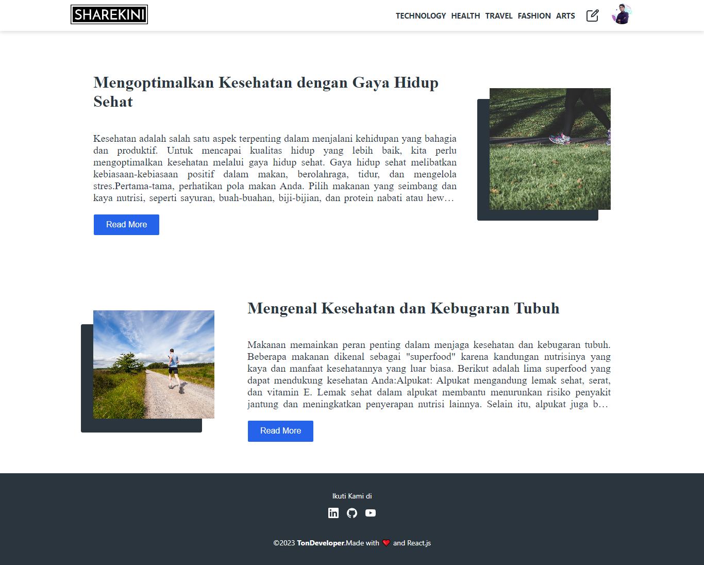

# Full-Stack Blog - A Dynamic Blogging Platform

Full-Stack Blog is an open-source project that provides a dynamic and interactive blogging platform. This project allows users to create, manage, and share posts on various topics with ease.

## `Preview Project 👇`




## Key Features:

- User Account Creation: Users can sign up and log in to their personal accounts to start writing and managing posts.
- Post Writing: Users can easily create and write posts using an intuitive writing interface.
- Post Management: Users can manage their posts, edit, delete, and set publication status.
- Categories and Tags: Posts can be categorized and tagged for easy navigation and searching.

## Technologies Used:

- Frontend: The frontend is built using React, enabling dynamic and interactive views.
- Backend: The backend is powered by Node.js and Express to handle requests and access the database.
- Database: Post data and user information are stored in a Mysql database, providing fast performance and scalability.
- Authentication: The project uses JWT (JSON Web Token) authentication system to secure routes and authenticate users.
- Styling: Styling and layout of the pages are done using the Tailwind CSS framework, allowing responsive design and easy customization.

## Local Setup:

1. Clone this repository to your computer with the command:

```
git clone https://github.com/tondeveloperr/fullstack-blog-app.git
```

2. Open the terminal and navigate to the project directory with:

```
cd fullstack-blog-app
```

3. Install frontend dependencies by running:

```
cd frontend && npm install
```
4. Install frontend dependencies by running:

```
 cd backend && npm install
```
5. Make sure MySQL is installed and running on your system.

6. Create a new MySQL database and configure the `.env` file in the backend directory with your database settings and JWT secret key as needed.
7. Run the backend server with:
```
 cd backend && npm run dev
```
8. Run the frontend development server with:

```
 cd frontend && npm run dev
```
in a separate terminal window.

## Contribution:

We welcome contributions from the open-source community. If you wish to contribute to this project, please create a pull request with the proposed feature or fix.

We hope Full-Stack Blog can help you get started with a feature-rich blogging project and open doors to further learning about web development.

## License:

This project is licensed under the MIT License. See the `LICENSE` file for more details.
